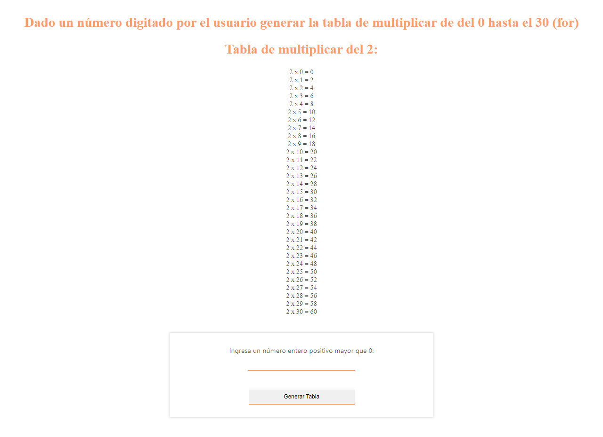

<h1>TALLER 10 - Mishell Nikol Uribe Guerrero</h1>

<h2>Información</h2>

Curso: Full Stack Básico - Grupo 1

Profesor: Cristian Patiño

<h2>Punto 1: constantes y variables</h2>

<h2>Punto 2: suma de dos números</h2>

<h2>Punto 3: suma de dos números ingresados por el usuario</h2>

<h2>Punto 4: Mostrar en consola el nombre y apellido</h2>

<h2>Punto 5: Valor según el tipo de afiliación</h2>

<h2>Punto 6: Imprimir si es mayor de edad o no</h2>

<h2>Punto 7: Imprimir resultado de calquier operación</h2>

<h2>Punto 8: Valor según el tipo de afiliación</h2>

<h2>Punto 9:Generar tabla de multiplicar de 0 a 30 (while)</h2>

<h2>Punto 10:Números Pares del 0 al 100 (while)</h2>

<h2>Punto 11:Suma de números pares del 0 al 100(for)</h2>

<h2>Punto 12:tabla de multiplicar de del 0 hasta el 30 (for)</h2>

<h2>Punto 13:5 posiciones generar la suma de los numeros (for)</h2>

<h2>Punto 14: registrar por el usuario generar validaciones</h2>

<h2>Punto 15: registrar por el usuario generar validaciones</h2>

